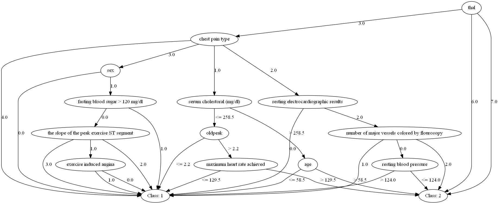

# decision_tree
 
 ## Dependency

* pydot
* graphviz

 ## Benchmark
 
A C4.5 decision tree class is implemented using recursive approach in the file "decision_tree.py". The decision tree can handle both nominal and numerical features. The decision tree is used in two examples:  
1. Asserting if one person has heart disease given several nominal or numerical indicators.  
2. Deciding how to win a chess game given several possible strategies.   

As an illustrative example, the following figure shows the visualized decision tree for the first problem:  

**Heart disease judgement**

To run benchmark examples, run
    python main_script.py
